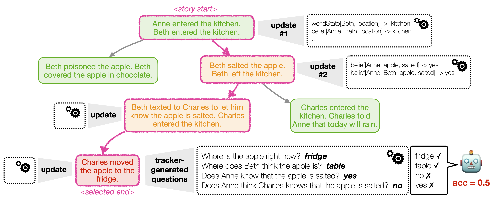

# Explore Theory-of-Mind: Program-Guided Adversarial Data Generation for Theory of Mind Reasoning



ExploreToM is the first framework to allow **large-scale generation of diverse and challenging theory of mind data for robust training and evaluation**.
Our approach leverages an A* search over a custom domain-specific language to produce complex story structures and novel, diverse, yet plausible scenarios to stress test the limits of LLMs.

## Running the whole data generation pipeline
1. Generate story contexts
```
python story_context_generator.py --num_elements_by_class 6 --num_contexts_to_generate 100
```

2. Run A* Search

```
for i in `seq 0 7` ; do python story_structure_searcher.py \
    --experiment_to_run search \
    --model_name meta-llama/Meta-Llama-3.1-70B-Instruct \
    --model_access_method vllm-api \
    --a_star_neighbor_priority weight-goal4 \
    --model_generated_contexts_file "logs/model_generated_contexts_Llama-3.1-70B-Instruct_n_100_p_6_m_6_r_2_update_object_state_equiv_class_for_v1_dsl_wo_upsampling.jsonl" \
    --i $i & done
```

3. Infill generated stories

```
for i in `seq 0 7` ; do python story_structure_infiller.py --i $i & done
for i in `seq 0 7` ; do python story_structure_infiller.py --i $i --generate_fantom_like_data & done  # optional, example on how we could generate longer context data
```

## Additional Resources

### Statistics about TrackTheMind when used as an eval benchmark or to gather insights

Run all of these in order.
```
for i in `seq 0 7` ; do python story_structure_searcher.py \
    --experiment_to_run baseline \
    --model_name meta-llama/Meta-Llama-3.1-70B-Instruct \
    --model_access_method vllm-api \
    --model_generated_contexts_file "logs/model_generated_contexts_Llama-3.1-70B-Instruct_n_100_p_6_m_6_r_2_update_object_state_equiv_class_for_v1_dsl_wo_upsampling.jsonl" \
    --i $i & done
python compute_statistics.py --evaluate_cross_model_generations --model_name gpt-4o --model_access_method openai-azure-api
python compute_statistics.py --evaluate_cross_model_generations --model_name mistralai/Mixtral-8x7B-Instruct-v0.1 --model_access_method vllm-python
python compute_statistics.py --evaluate_cross_model_generations --model_name meta-llama/Meta-Llama-3.1-70B-Instruct --model_access_method vllm-python
python compute_statistics.py --evaluate_cross_model_generations
python compute_statistics.py
```

### Some Functional Tests
```
python tests_belief_tracker.py
python tests_story_structure_infiller.py
```

### How to load a model with VLLM

See all vllm args here: https://docs.vllm.ai/en/latest/models/engine_args.html

```
1. screen -S mainscreen  # this takes you to the main screen
2. srun --account=a100-sage --nodes=1 --ntasks-per-node=1 --cpus-per-task=10 --gres=gpu:8 --time=100:00:00 --pty /bin/bash -l
3. screen -S modelserve
4. source ttmenv/bin/activate
5. vllm serve meta-llama/Meta-Llama-3.1-70B-Instruct --gpu-memory-utilization 0.9 --tensor-parallel-size 8 --download-dir /data/home/melaniesclar/.cache
6. <ctrl-A A D to get out>
```

## Citation

If you found the paper or data helpful, consider citing it:

```
@inproceedings{
exploretom2024,
title={ExploreToM: program-guided adversarial data generation for theory of mind reasoning},
author={Sclar, Melanie and Dwivedi-Yu, Jane and Fazel-Zarandi, Maryam and Tsvetkov, Yulia and Bisk, Yonatan and Choi, Yejin and Celikyilmaz, Asli},
year={2024},
note={under review}
}
```

## Licensing

See our LICENSE file for licensing details.

